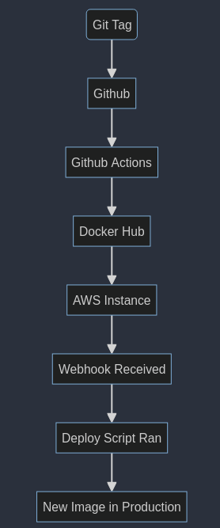

# Name: Parker Williams

# NOTE: You may need to download the video from the repo or use a link, it won't show up on GitHub even though it's embedded

## Project 5

### Part 1 - Semantic Versioning

- CD Project Overview

  

  - The point of this project is to use semantic versioning for Docker images that are pushed to DockerHub whenever `git` tags are pushed, using GitHub Actions. We are also using webhooks to make sure our repository and image are up to date.

- Generating a tag in `git` / GitHub

  - `git tag v(major)(minor)(patch)`
  - This is done after you have added and committed files
  - `git push --tags` to push to GitHub

- Behavior of GitHub workflow

  - Pushes the changes and tags to the remote repository on GitHub, and pushes the image to DockerHub, all with semantic versioning.

- Link to DockerHub repository

  - https://hub.docker.com/repository/docker/1blckhrt/dockerhubrepo/general

### Part 2 - Deployment

- Install docker on the instance

  ```bash
  sudo apt-get update
  sudo apt-get install ca-certificates curl
  sudo install -m 0755 -d /etc/apt/keyrings
  sudo curl -fsSL https://download.docker.com/linux/ubuntu/gpg -o /etc/apt/keyrings/docker.asc
  sudo chmod a+r /etc/apt/keyrings/docker.asc
  ```

  ```bash

  echo \
   "deb [arch=$(dpkg --print-architecture) signed-by=/etc/apt/keyrings/docker.asc] https://download.docker.com/linux/ubuntu \
   $(. /etc/os-release && echo "$VERSION_CODENAME") stable" | \
   sudo tee /etc/apt/sources.list.d/docker.list > /dev/null
  sudo apt-get update
  ```

- setup deploy script and make sure to chmod +x it

  - `deploy.sh`

    - ```bash
      #! /bin/bash
      # kill old processes

      docker stop nginx
      docker remove nginx

      # pull fresh image

      docker pull 1blckhrt/dockerhubrepo:2.0.1

      # run new image

      docker run -d -p 80:80 --name nginx --restart always 1blckhrt/dockerhubrepo:2.0.1
      ```

    - allows me to setup a new docker image and stop/remove the existing one, will eventually be used with the webhook

    - should be in home directory of user (ubuntu) just for ease of access

- install webhook

  - `sudo apt-get install webhook`

- `webhook` task definition file
  - ```
    # Webhook Configuration
    webhooks:
      - id: nginx_webhook
        execute-command: "deploy.sh"
        command-working-directory: "/home/ubuntu"
        pass-arguments-to-command:
        response-message: "Webhook received and task triggered successfully."
    ```
- `/home/ubuntu` is the location of the task definition file

- how to start the webhook

  - `webhook -hooks hooks.json` (in home directory)

- make it so that the webhook turns on automatically at boot

  - `sudo vim /lib/systemd/system/webhook.service`
  - ```
    [Unit]
    Description=Webhook Service
    After=network.target

    [Service]
    User=ubuntu
    ExecStart=/path/to/webhook -hooks /home/ubuntu/hooks.json

    [Install]
    WantedBy=multi-user.target
    ```

  - `sudo systemctl daemon-reload`
  - `sudo systemctl enable webhook`
  - `sudo systemctl start webhook`

  - update workflow to curl the public IP of the instance

# Proof of flow

# If this doesn't show up for you, download the video in the `./videos` folder or visit this youtube link

<video controls src="./videos/test.mp4" title="Test video"></video>

https://www.youtube.com/watch?v=zwOFXH7-7rI

# Resources

- ChatGPT
- Webhook Repository
- Docker Documentation
