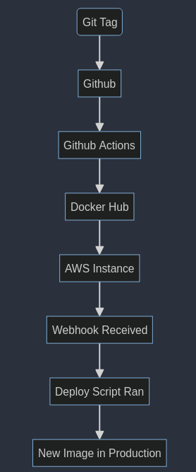
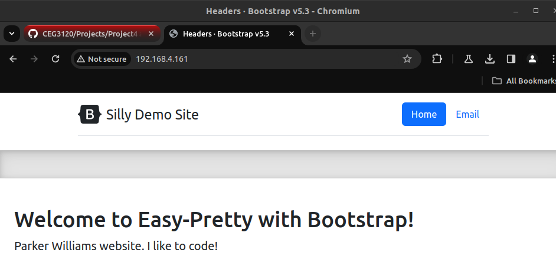

# Name: Parker Williams

## Project 4

### Part 1 Documentation

- **CI Project Overview**

  - I am creating a Docker image and container to speed up the process of hosting a website using NGINX.

  

  - Utilizing Docker, Docker Hub, and a Dockerfile.

- **Run Project Locally**

  - **Installing Dependencies:**

    ```bash
    sudo apt-get update
    sudo apt-get install ca-certificates curl
    sudo install -m 0755 -d /etc/apt/keyrings
    sudo curl -fsSL https://download.docker.com/linux/ubuntu/gpg -o /etc/apt/keyrings/docker.asc
    sudo chmod a+r /etc/apt/keyrings/docker.asc
    ```

    ```bash

    echo \
     "deb [arch=$(dpkg --print-architecture) signed-by=/etc/apt/keyrings/docker.asc] https://download.docker.com/linux/ubuntu \
     $(. /etc/os-release && echo "$VERSION_CODENAME") stable" | \
     sudo tee /etc/apt/sources.list.d/docker.list > /dev/null
    sudo apt-get update
    ```

  - **Building the Docker image from the Dockerfile:**

    - Navigate into the directory with website files and the `Dockerfile`.
    - Run the following command:

      ```bash
      docker build -t nginx-williams .
      ```

  - **Running the container:**

    ```bash
    docker run -d -p 80:80 nginx-williams
    ```

  - **Viewing the project running in the container:**
    - Open a web browser and type in the search bar the private IP of your machine followed by port 80.
    - Example: `192.168.4.161:80`



### Part 2 Documentation

- **Public Repo Creation**

  - Go to `hub.docker.com`, sign in, and click on Repositories in the main menu.
  - Click "Create Repository" (blue button near the top right) and fill in name and description.

- **Authenticating with DockerHub via CLI**

  - I tried to log in with a token as this is essentially a security key that only I have, but I think somewhere something messed up. I was only able to login after I reset my password, but the token still is fine.
    - Go to `hub.docker.com`, create a token in the account menu under security.
  - Run the following command in the terminal:

    ```bash
    docker login -u (username)
    ```

    - Enter username and then the token when prompted.

- **Pushing Container Image to Dockerhub**

  - Tag and push the image

    ```bash
    docker tag <image_id> <dockerhub_username>/<repository_name>:<tag>
    docker login
    docker push <dockerhub_username>/<repository_name>:<tag>
    ```

  - Dockerhub link
    - https://hub.docker.com/repository/docker/1blckhrt/dockerhubrepo/general

- **Configuring GitHub Secrets**

  - How to set a secret
    - go to the GitHub repo you want to setup a secret for
    - go to settings -> secrets -> new repo secret
    - enter name and value
    - add secret
  - secrets that are set for this project
    - Dockerhub token

- **Behavior of GitHub workflow**

  - triggered upon a defined event, such as a git push, pull, etc
  - automates various tasks

  - Dockerhub token and file paths are specific to my project
    - will need to be changed if someone else uses it
